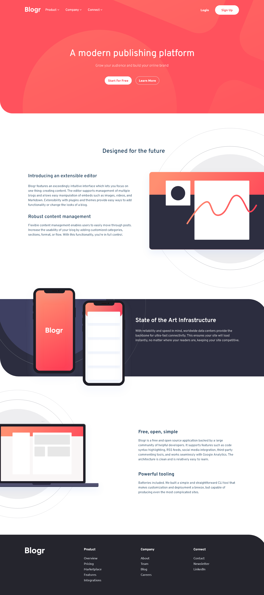

# Frontend Mentor - Blogr landing page solution

This is a solution to the [Blogr landing page challenge on Frontend Mentor](https://www.frontendmentor.io/challenges/blogr-landing-page-EX2RLAApP). Frontend Mentor challenges help you improve your coding skills by building realistic projects.

## Table of contents

- [Overview](#overview)
  - [The challenge](#the-challenge)
  - [Screenshot](#screenshot)
  - [Links](#links)
- [My process](#my-process)
  - [Built with](#built-with)
  - [What I learned](#what-i-learned)
  - [Continued development](#continued-development)
  - [Useful resources](#useful-resources)
- [Author](#author)
- [Acknowledgments](#acknowledgments)

## Overview

### The challenge

Users should be able to:

- View the optimal layout for the site depending on their device's screen size
- See hover states for all interactive elements on the page

### Screenshot



### Links

- Solution URL: [GitHub Repo](https://github.com/CosMo578/blogr-landing-page-main)
- Live Site URL: [Blogr Landing Page](https://blogr-landing-page-raph.vercel.app/)

## My process

### Built with

- Semantic JSX markup
- CSS custom properties
- Flexbox
- Mobile-first workflow
- [Tailwind Css](https://tailwindcss.com/) - For styles
- [React](https://reactjs.org/) - JS library

### What I learned

- I implemented my very first custom react hook to renders components conditionally based on the viewport width.

```jsx
import { useState, useEffect } from "react";

export default function useWindowSize() {
  const [windowSize, setWindowSize] = useState({ width: window.innerWidth });

  useEffect(() => {
    const handleResize = () => {
      setWindowSize({ width: window.innerWidth });
    };
    window.addEventListener("resize", handleResize);
    return () => window.removeEventListener("resize", handleResize);
  }, []);
  return windowSize;
}
```

### Continued development

### Useful resources

- [Gemini](https://gemini.google.com) - This AI helped me finally understand how to conditionally render components in react based on the viewport width. I'd recommend it to anyone still learning this concept.

## Author

- Website - [Developer Raph](https://raph-portfolio-v2.vercel.app)
- Frontend Mentor - [CosMo578](https://www.frontendmentor.io/profile/CosMo578)
- Twitter - [Developer Raphael](https://www.twitter.com/@dev_raph_)

## Acknowledgments

Google bard helped me in implementing the logic for my custom hook. I acknowledge the developers of the bard project.
